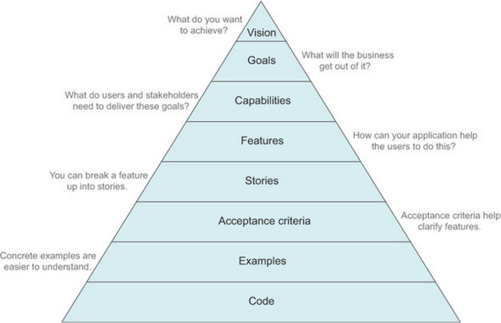

# BDD template

## How to Install

```
npm install
```

## How to Test

Run individual stages:

```
npm run unittest
npm run acceptance
```

Or run everything:

```
npm test
```

## How to Run

```
npm start
```

## How to TCR

If you like the [`Test && Commit || Reset`](https://medium.com/@kentbeck_7670/test-commit-revert-870bbd756864) pattern, it is built right in (on the unit tests, but can easily be adapted):

```
npm run tcr
```

## Structure

| What?            | Where?               |
| ---------------- | -------------------- |
| Unit tests       | `spec/*Test.ts`      |
| Acceptance tests | `features/*.feature` |
| Source code      | `src/*.ts`           |

# Helpful Resources

## Example BDD Kata

All credit to [Sandro Mancuso and Samir Talwar](https://monospacedmonologues.com/2013/04/the-social-networking-kata/).

### Your Backlog

- Posting: Alice can publish messages to a personal timeline
- Reading: Bob can view Alice's timeline
- Following: Charlie can subscribe to Alice's and Bob's timelines, and view an aggregated list of all subscriptions
- Mentions: Bob can link to Charlie in a message using "@"
- Links: Alice can link to a clickable web resource in a message
- Direct Messages: Mallory can send a private message to Alice

## BDD Pyramid

All credit to [BDD in Action](https://www.manning.com/books/bdd-in-action).



## Javascript Regex Cheat Sheet

| Character   | Meaning                                     |
| ----------- | ------------------------------------------- |
| `.`         | Anything                                    |
| `[0-9a-z]`  | Any character from 0-9 or a-z               |
| `[^0-9a-z]` | Any character _not_ in the range 0-9 or a-z |
| `\d`        | Shorthand for `[0-9]`                       |
| `\D`        | Shorthand for `[^0-9]`                      |
| `\w`        | Shorthand for `[A-Za-z0-9_]`                |
| `\W`        | Shorthand for `[^A-Za-z0-9_]`               |
| `^`         | Start of line (or string)                   |
| `$`         | End of line (or string)                     |
| `\b`        | Word boundary                               |
| `X|Y`       | Matches `X` or `Y`                          |
| `X*`        | Matches `X` zero or more times              |
| `X+`        | Shorthand for `XX*`                         |
| `X?`        | Matches `X` optionally                      |
